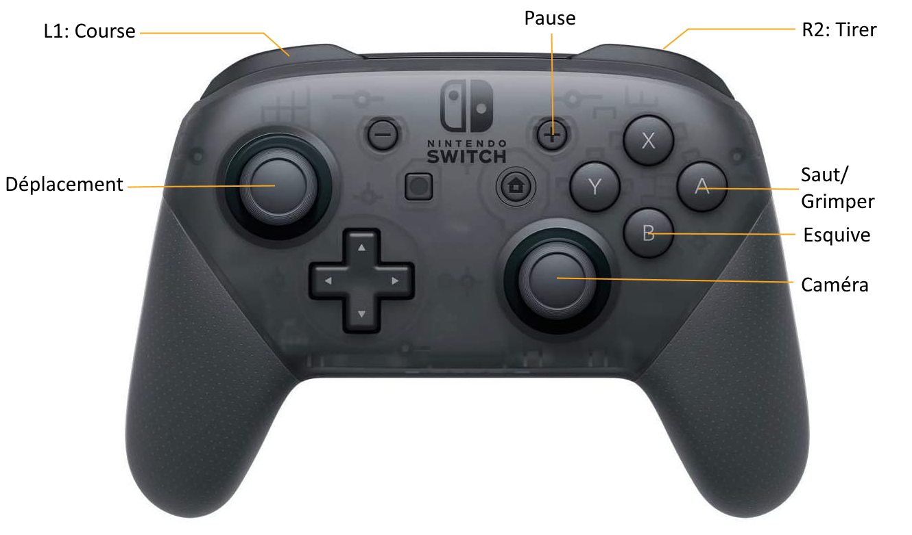

# **Twilight Archery**

## **Summary**
- [Description](##Description)
- [Targets](##Targets)
- [Commands](##Commands)
- [References](##References)

 

## **Description**

The project objective is to create a collaborative (splitscreen) TPS using Unreal Engine.
The actions takes place in an arena where you'll have to defeat a monster with your bow.

 

## **Targets**

**PC** and **Switch**.

 

## **Commands**

QWERTY:
---

Command             | Action
-------             | ------
W                   | Move forward
A                   | Move left
S                   | Move backward
D                   | Move Right
Left Shift          | Sprint
Left Ctrl           | Dodge
Space bar           | Jump
Esc / P             | Pause / Unpause the game
Move Mouse          | Move the camera around the player
Mouse Right Click   | Shoot

## **Gamepad**

 

## **References**

Unreal Engine
---
- https://docs.unrealengine.com/4.26/en-US/